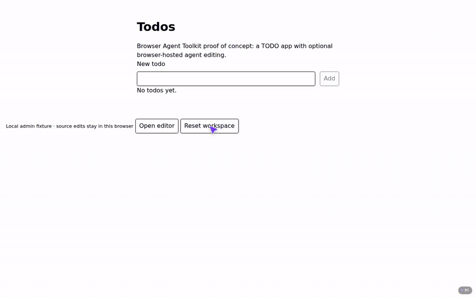

# Browser Agent Toolkit

**Coding agent in your web app.**

Runs the OpenCode *server* in the browser, along with a filesystem, a shell and
your app's dev server, all in the user's tab.

- **Zero VM hosting costs.** Inference is the only per-session cost, and users
  could cover that themselves by signing in with OpenAI (planned).
- **No sandbox to secure.** Agent-run code never executes on your servers. The
  browser tab is the sandbox, and a `Connection-Allowlist` header can stop it
  sending anything to another origin (planned).
- **Live preview.** The agent edits your app's source and it hot-reloads.
- **The real OpenCode, not a reimplementation.**
- **Fits an existing app.** One package, optional React helpers.



The [TODO example](examples/todo-app/README.md), recorded in Chrome on this branch. The
editor opens in real time (1.7 s here, the first open of a reset workspace); only the
model's 22 s of work plays at 4x, where the "4x" label shows. Everything else is real time.

## Try it

With the [prerequisites](#prerequisites) installed, from the repository root:

```sh
cp examples/todo-app/.env.example examples/todo-app/.env.local   # put the model key in it; optional
bun run editor
```

That builds the Rust and TypeScript pieces, fetches the pinned OpenCode server, prepares
and builds the example and serves it. Open `http://127.0.0.1:3000` (`PORT=…` to change it)
in Chrome and choose **Open editor**. Without a key the editor and the preview work and
the chat explains what is missing. A first build takes about two minutes (113 s measured
from a fresh clone with warm Cargo and Bun caches); after that, a few seconds.

## Startup

"Open editor" in the TODO example: Vite 7 with React Router and Tailwind, and the real
OpenCode 2.0.3 server, both started inside the tab. Chrome 154 on a 12-core Linux machine
that was busy with other work (load average 4.6–4.9); milliseconds, median (min–max) of
12 reopens.

| | Previous runtime | Now | Native Node 24, same programs |
| --- | --- | --- | --- |
| Runtime boot, dependency tree mounted | ~2,000 | 90 (81–122) | – |
| Dev server listening, after its spawn | 1,600 | 426 (379–554) | 406 (377–433) |
| App visible in the preview, after the spawn | 3,900 | 1,004 (865–1,268) | 880 (863–952), requests only |
| OpenCode attached, after its spawn | 3,200 | 1,032 (880–1,393) | 1,336 (1,286–1,394) |
| Click to app visible and chat ready | 7,200 | **1,171** (998–1,545) | – |

A visitor's very first open, with the 32 MB compressed dependency image still to download,
took 2.5 s on localhost (n = 4); the image finishes arriving in the background. Sample
sizes, the native method, what is slower and everything not yet measured (an idle machine,
a real network, any browser but Chrome) are in the
[summary](docs/experiments/2026-10-10-rust-rewrite-summary.md).

## How it works

- **A library kernel in Rust**, compiled to one Wasm module that every worker instantiates
  over the same shared memory: filesystem, pipes, sockets, HTTP and WebSocket codecs,
  process table and Node module resolution. A system call is a function call; there is no
  kernel thread and no message protocol.
- **The dependency tree is one immutable image file** in the browser's private file
  system (OPFS). Opening the editor reads its index; file bodies are read when used.
  Everything written goes to an overlay that is journaled to OPFS.
- **Modules are compiled at prepare time** by a native Rust tool (oxc): each dependency is
  stored already in the loader's format, and the modules a program needs to start are
  emitted as one script the browser keeps compiled between visits.
- **Programs are real**: each `node` process is a Web Worker running the app's own Vite
  and the real OpenCode 2.0.3 server bundle against Node's built-in modules.
- **Rust**: kernel, image format, the prepare tool, the module transform, a POSIX shell
  with coreutils, zlib and digests, and the backends that stand in for native tools
  (esbuild-shaped transforms, Tailwind's scanner). **TypeScript**, because these are
  JavaScript APIs or browser glue by nature: the objects guest programs touch (`fs`,
  `http`, `child_process`, …, thin over kernel calls; pure-JS modules are Node's own
  `lib/`), the worker bootstrap and module loader, the service worker that routes the
  preview frame, and the toolkit package with its React chat UI.

Design: [`docs/design/rust-rewrite.md`](docs/design/rust-rewrite.md); what changed while
building it: [`docs/design/decisions.md`](docs/design/decisions.md).

## Using it in an app

One package, `@kkrausse/browser-agent-toolkit` ([its README](packages/toolkit/README.md)),
five entry points for three moments:

1. **Prepare**, at build time. `./prepare` packs the app's dependencies into the image,
   lists the source the agent may edit and writes a directory of static files. `./vite` is
   the plugin for the app's Vite config (the guest's base path, and which of the host's
   chunks are private to the editor).
2. **Serve**. `./server` gives a fetch handler for that directory and a proxy for model
   requests, so the provider key stays on the server. The app decides who may edit before
   calling it, and adds the handler's cross-origin isolation headers to its own pages.
3. **Open**, in the browser. `./browser` has `openEditor()`, which boots the runtime,
   installs the source, starts the dev server and OpenCode and returns the files, the
   preview and the chat controller; `preloadEditor()` warms it up when the button is
   shown. `./react` has the preview frame, the chat view and a hook.

[`examples/todo-app`](examples/todo-app/README.md) is all of it in a small app.

## Status and limits

Experimental; nothing is published. This is not a general Linux or Node: it runs these two
programs and what they need.

- **Chrome only so far.** Firefox and Safari have not been tried.
- The pages that host the editor must be **cross-origin isolated** (COOP `same-origin`,
  COEP `require-corp`); the server handler supplies the headers.
- The app needs a server for its API and the model proxy; it is not a static site. No
  hosted demo, no bring-your-own-key or provider login yet.
- **The agent has no shell tool.** It reads, edits, searches (ripgrep) and runs JavaScript
  (`runJavascript`, where `child_process` has a real shell). OpenCode's own shell tool is
  not enabled.
- **No package install inside the guest**: the agent works with the dependencies the app
  was prepared with.
- `worker_threads.Worker` is missing, and the Node surface is what Vite and OpenCode use.
- One editor per origin at a time; a second tab is told so.
- A dependency change means a new 239 MB image (32 MB compressed) for every visitor.
- The IRS tools have not been migrated to this API.

The ranked list of known gaps is in the
[summary](docs/experiments/2026-10-10-rust-rewrite-summary.md#6-known-gaps-and-unverified-items-ranked).

# Development

## Repository layout

| Directory | Purpose |
| --- | --- |
| `crates/bat-kernel/` | the library kernel (Rust, `wasm32-wasip1-threads`, shared memory) |
| `crates/bat-image/` | dependency image format: reader and writer |
| `crates/bat-modules/` | module transform and CommonJS/ESM facts (oxc); native library and Wasm build |
| `crates/bat-prepare/` | native CLI: dependency tree to image, compiled modules, program scripts |
| `crates/bat-sh/` | the guest's `/bin/sh` and coreutils |
| `crates/bat-node-native/` | zlib and digests for the guest's `zlib` and `crypto` |
| `crates/bat-tools/` | Wasm backends for esbuild-shaped transforms and Tailwind's scanner |
| `runtime/` | TypeScript: kernel bindings, process worker, loader, Node built-ins, SQLite, page host, service worker; `harness/` runs guest scripts in Chrome |
| `packages/toolkit/` | `@kkrausse/browser-agent-toolkit`: prepare, server, browser, react, vite |
| `packages/guest-shims/` | packages laid over native-tool packages in the guest (esbuild, lightningcss, Tailwind oxide) |
| `examples/todo-app/` | React Router + Bun/tRPC TODO app with the editor; `demo/` drives and records the scenario |
| `bench/` | the drivers behind the numbers in `docs/experiments/` |
| `third_party/` | Node's `lib/` and the notices |
| `docs/design/`, `docs/experiments/` | design, decisions, formats; measurements and reports |

## wasm-term

[`wasm-term/`](wasm-term/README.md) is a separate project kept in this repository: real
terminal clients (the OpenCode and codex TUIs) running in a browser tab on an emulated
machine with a pty. It has its own README, build, checks and `third_party/`, and is in
neither the Cargo workspace nor the bun workspaces, so nothing above builds or tests it. It
builds its shell from `crates/bat-sh`, and `examples/terminal-app` embeds its OpenCode client.

## Prerequisites

None of these is installed by the repository:

- Bun (1.4.0 used) and Node 24 on `PATH`;
- Rust (1.99 used) with `rustup target add wasm32-wasip1-threads wasm32-unknown-unknown`;
- `tar` and network access for the first setup (npm packages, crates, the OpenCode server);
- Chrome.

Optional: bubblewrap on Linux (prepare then builds Vite's dependency cache at the guest's
own paths; without it a fallback is used that has only been run on Linux), and `wasm-opt`
on `PATH` (smaller Wasm). Three Wasm files are committed, so their toolchains are not
needed: SQLite (`runtime/src/sqlite/native/build.sh --fetch` rebuilds it with a pinned
wasi-sdk), the esbuild-shaped transform and the Tailwind scanner
(`crates/bat-tools/build-wasm.sh`, `crates/bat-tools/oxide/build-wasm.sh`).

## Commands

```sh
bun run setup       # build everything the example needs; incremental
bun run editor      # setup, then prepare + build + serve examples/todo-app (PORT, default 3000)
bun run typecheck   # runtime, toolkit, example
bun run build       # the toolkit package only
```

`bun run setup` runs, in order: `bun install`; the OpenCode 2.0.3 server into the
gitignored `.runtime/` (downloaded from a checksummed release asset, or
`BAT_OPENCODE_DIR`); `kernel.wasm`, `bat_modules.wasm`, `bat_node_native.wasm`,
`bat_sh.wasm` and the `bat-prepare` CLI into `target/`; the runtime bundles into
`runtime/dist/`; the toolkit into `packages/toolkit/dist/`. After a change to Rust or
runtime code, run it again and restart the example.

Checks that exist: `runtime/harness/check.sh` (guest scripts in Chrome through the
`browser-control` CLI), `examples/todo-app/demo/run.ts` (the scenario above, one real
model conversation per run), `bench/startup/run.ts` and `bench/first-open/run.ts`.

## History and licensing

This is a from-scratch rewrite (2026-10-09). The previous toolkit and its Vivari-based
runtime, with their reports, release notes and CI, are in the git history up to commit
`44dcd92`; nothing here depends on them.

No umbrella license has been chosen for this repository. Third-party code that is
vendored or embedded (Node.js `lib/`, shims from Vivari, SQLite and wasi-libc, the
Tailwind scanner, oxc and the other Rust crates, lightningcss files) is listed with its
license in [`third_party/NOTICES.md`](third_party/NOTICES.md); what the toolkit package
took from OpenCode, shadcn/ui and Marked is in
[`packages/toolkit/NOTICES.md`](packages/toolkit/NOTICES.md).
