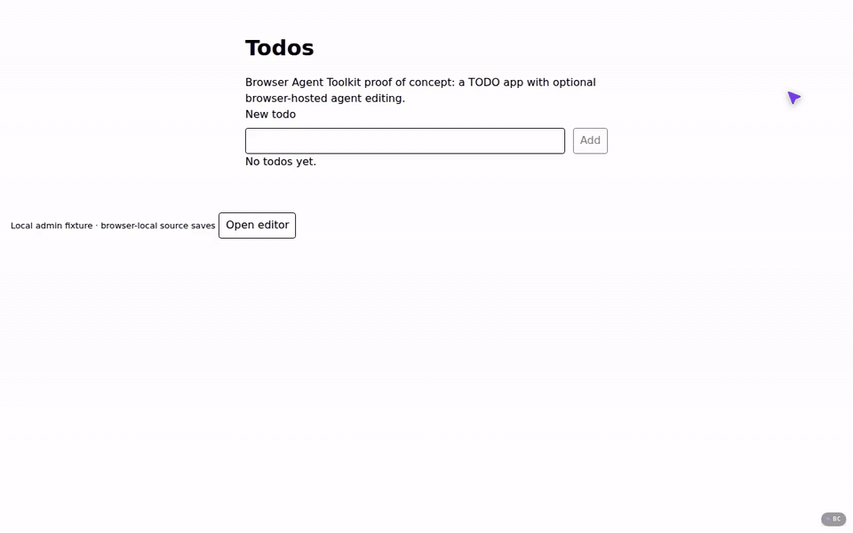

# Browser Agent Toolkit

**Run agent harnesses in the browser.**

Experimental workspace and OpenCode integration built on
[Vivari](https://github.com/kkrausse/vivari). A browser-hosted
workspace supplies files, execution, service endpoints, and a live preview.
OpenCode runs its server and agent loop inside that workspace; model inference
still happens at a configured provider.



The [TODO example](examples/todo-app/README.md), recorded in Chrome. Editor
startup plays at 3x and the agent's run at 5x; the rest is real time.

## Repository layout

| Directory | Purpose |
| --- | --- |
| `workspace-api/` | `@kev-browser-agent-kit/workspace`: filesystem/persistence, execution, endpoints, previews, explicit preparation/delivery operations, optional React lifecycle helpers |
| `opencode-chat/` | `@kev-browser-agent-kit/opencode-chat`: OpenCode artifacts/config/start/readiness/client plus optional chat/editor UI |
| `examples/todo-app/` | Local React Router + Bun/tRPC TODO application with an optional browser editor |
| `vivari/` | Runtime source pins, build/packaging tools, and runtime qualification support |

Development package names are retained. Source lives at
[`kkrausse/browser-agent-toolkit`](https://github.com/kkrausse/browser-agent-toolkit).
Versioned external consumers use GitHub Packages; local builds remain supported.
See [releasing and consuming packages](docs/RELEASING.md) for the manual workflow,
exact-version installs, runtime asset delivery and local overrides.
The first published version is [`0.1.0-alpha.1`](docs/releases/0.1.0-alpha.1.md),
an experimental release with clean CI packaging and browser runtime checks.

## Local setup

Prerequisites, none of which this repository installs:

- Bun 1.4.0, git, tar and network access.
- Rust 1.93.0 with `wasm32-unknown-unknown` and `wasm32-wasip1`, and wasm-pack
  0.13.1 (`cargo install wasm-pack --version 0.13.1 --locked`), for the runtime.
- Rust 1.95.0 with `wasm32-wasip1-threads`, for the Tailwind backend.

From the repository root:

```sh
bun run setup
```

Setup reuses whatever already exists and never resets a checkout. In order it:

1. clones the pinned runtime fork into the gitignored `vendor/vivari`
   (`vivari/scripts/setup-runtime.ts`, only when absent);
2. builds the runtime, native Wasm included (`vivari/scripts/build-runtime.ts`);
3. downloads and verifies the prepared OpenCode 2.0.3 application
   (`scripts/setup-opencode.ts`);
4. builds the source-pinned Tailwind backend once
   (`vivari/scripts/setup-tailwind-candidate.ts`; fetches the pinned Node into
   `vivari/.runtime`);
5. installs and builds both packages, packages the runtime distribution into
   `workspace-api/dist/runtime`, then installs and builds the example
   (`scripts/build.ts --install`).

A first run took about two minutes on an Apple-silicon laptop with warm Cargo and
Bun download caches, mostly the two Rust builds; a repeat run takes about ten
seconds. Then start the example with its browser editor:

```sh
cd examples/todo-app
bun run editor
```

Open `http://127.0.0.1:3000` and choose **Open editor**. See
[`examples/todo-app/README.md`](examples/todo-app/README.md) for the model key,
catalog and port. The ordinary TODO application does not require a model key.

Other root commands:

```sh
bun run build           # rebuild both packages and repackage the runtime distribution
bun run dev             # rebuild/refresh local packages, then start the example in dev mode
bun run build:example   # rebuild/refresh and produce the example production build
bun run test
bun run typecheck
```

`bun run build` builds the library packages in dependency order. Root commands
refresh Bun's installed local package copies, so changes are included on the next
build without version bumps or a manual dependency update. Local consumers use
`workspace-api/dist/lib` and `opencode-chat/dist`. After editing the runtime fork,
run `bun vivari/scripts/build-runtime.ts` and then `bun run build`; see
[`vivari/DEVELOPMENT.md`](vivari/DEVELOPMENT.md).

**Live cross-package watching is not wired yet.** During a running example dev
session, toolkit source changes need a restart via `bun run dev` to rebuild and
refresh dependencies. Ordinary example source edits use the app's existing HMR.
The automatic toolkit watcher and `irs-tools` build/deploy integration are later
work, not guarantees of this extraction.

### Prepared OpenCode prerequisite

The chat build verifies an exact OpenCode 2.0.3 artifact and receipt before copying
them into the package. The artifact is generated, ignored, and not included in a
source checkout. `bun run setup` fetches the previously qualified artifact from its
checksummed GitHub Release asset into `vivari/.runtime/opencode-release-2.0.3`
(`bun scripts/setup-opencode.ts` does only that step). Without network access,
seed it from another checkout that has it, or point `OPENCODE_PACKAGE_DIR` at the
directory holding the qualified `build-receipt.json` and
`.runtime/opencode-bun-server/` payload:

```sh
bun scripts/import-opencode.ts /path/to/integration/vivari
```

The rebuild recipe is in `vivari/experiments/opencode-release-server/`. Rebuilding
on another host may change artifact identities; a new build is not automatically
qualified and must not silently replace the pinned contract.

## Runtime and application delivery

The JS library packages, Vivari workers/WASM distribution, and prepared application
dependencies are separate build inputs. The runtime is the fork's single-kernel
line: one kernel worker plus guest process workers, and distribution packaging
rejects any other worker layout. Runtime changes require reloading the browser
workspace.

This is a compatibility POC, not arbitrary native Linux or stock Node/Bun execution.
OpenCode and tool delivery retain explicit compatibility packaging. The TODO
example uses a host Bun API and model proxy; it is not a static-only website.
There is no hosted demo or BYOK/login implementation in this extraction.

## History and licensing

This repository starts with a clean source snapshot from
`kkrausse/random` commit `0bcad3e36753b51bdcad3234d75ac9fc30907966`, under
`browser-container-poc/`. Original history and chronological status/acceptance
documents remain there. They describe the original environment, not fresh
qualification of this checkout.

New toolkit experiment results and status reports live in [`docs/experiments/`](docs/experiments/)
in this repository, alongside the implementation and reproduction harnesses.

Package licenses, upstream notices, and provenance are retained in their source
directories. See `opencode-chat/PROVENANCE.md`, its `LICENSE*` files, and
`vivari/LICENSE*`. No new umbrella licensing decision is made by this extraction.
